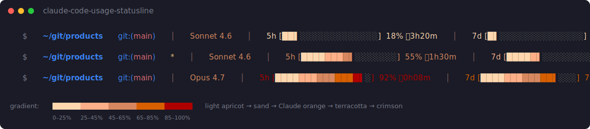
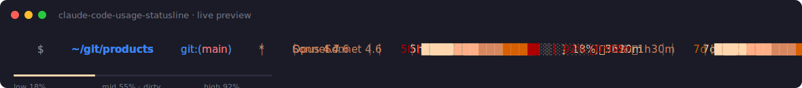

# claude-code-usage-statusline

A warm, Anthropic-branded **statusLine** for [Claude Code](https://code.claude.com)
that shows your token usage and rate-limit reset timers right above the prompt.

<p align="center">
  
</p>

<details>
<summary><b>▶ Show animated preview</b> (click to expand)</summary>

<p align="center">
  
</p>

</details>

```text
~/git/products git:(main) * │ Sonnet 4.6 │ 5h [████████▌░░░░░░░]  55% ⏰1h30m │ 7d [████▌░░░░░░░░░░░]  28% ⏰2d08h │ ctx [██▌░░░░░░░░░░░░░]  18%
```

[](LICENSE)
[](https://code.claude.com)
[](statusline.sh)

- **5h / 7d rate limits** with usage bar + reset countdown
- **Context window** usage bar
- **Current model** (Opus / Sonnet / Haiku)
- **Git branch** with dirty `*` indicator
- **16-cell gradient bar**, half-block (`▌`) precision, per-cell ANSI 256 colour
- Anthropic warm palette: `#FFD7AF → #D97757 → #AF0000`

## Requirements

- Claude Code **v2.1.92+** (rate-limit fields exposed in statusLine stdin)
- `jq`, `git`, `bash` — all standard on macOS / Linux
- A 256-colour terminal (every modern terminal qualifies)

## Install

### A) One-line script (simplest)

```bash
curl -fsSL https://raw.githubusercontent.com/laiyanlong/claude-code-usage-statusline/main/install.sh | bash
```

It downloads `statusline.sh` to `~/.claude/`, then patches `~/.claude/settings.json`
to wire it up. Existing files are backed up with a timestamp suffix. Restart
Claude Code afterwards.

### B) As a Claude Code plugin

```bash
# inside Claude Code
/plugin install laiyanlong/claude-code-usage-statusline
```

then run the bundled slash command:

```
/claude-code-usage-statusline:install
```

### C) Manual

```bash
mkdir -p ~/.claude
curl -fsSL https://raw.githubusercontent.com/laiyanlong/claude-code-usage-statusline/main/statusline.sh \
  -o ~/.claude/statusline.sh
chmod +x ~/.claude/statusline.sh
```

Then add to `~/.claude/settings.json`:

```json
{
  "statusLine": {
    "type": "command",
    "command": "bash ~/.claude/statusline.sh"
  }
}
```

## Gradient

| Bar position | Colour       | ANSI 256 | Hex      |
| ------------ | ------------ | -------- | -------- |
| 0–25%        | light apricot | 223     | #FFD7AF |
| 25–45%       | sand orange   | 216     | #FFAF87 |
| 45–65%       | Claude orange | 173     | #D7875F |
| 65–85%       | terracotta    | 166     | #D75F00 |
| 85–100%      | dark crimson  | 124     | #AF0000 |

The percentage label and frame share the colour of the highest filled cell, so
a glance tells you the severity.

## Customise

Set environment variables on the `command` line in `~/.claude/settings.json`.
Nothing else needs editing.

```json
{
  "statusLine": {
    "type": "command",
    "command": "STATUSLINE_PULSE=1 STATUSLINE_THEME=warm bash ~/.claude/statusline.sh"
  }
}
```

| Variable                  | Default | Values                                  | Effect                                                 |
| ------------------------- | ------- | --------------------------------------- | ------------------------------------------------------ |
| `STATUSLINE_BAR_WIDTH`    | `16`    | any integer (8 / 24 / 32 …)             | Number of cells per bar.                               |
| `STATUSLINE_THEME`        | `warm`  | `warm` · `classic` · `neon` · `mono`    | Gradient palette (see below).                          |
| `STATUSLINE_PULSE`        | `0`     | `0` · `1` · `2`                         | Animation. `1` = blink danger ≥85%. `2` = wave effect. |
| `STATUSLINE_HIDE`         | `""`    | comma list: `5h,7d,ctx,model,git,path`  | Skip sections you don't want.                          |
| `STATUSLINE_HALF_BLOCK`   | `▌`     | `▌` · `▎` · `▊` · any block char        | Half-cell character.                                   |
| `STATUSLINE_SEP`          | `│`     | `│` · `•` · `▸` · `⋯` · any char        | Section separator.                                     |

### Themes

| Theme     | Gradient (low → high)                                                     |
| --------- | ------------------------------------------------------------------------- |
| `warm`    | apricot → sand → Claude orange → terracotta → crimson  (Anthropic brand) |
| `classic` | green → yellow → orange → red                                             |
| `neon`    | cyan → bright-cyan → magenta → pink → violet                              |
| `mono`    | white → grey ramps                                                        |

### Animation: `STATUSLINE_PULSE`

- `0` (default) — fully static.
- `1` — when any meter is **≥85%**, the rightmost filled cell uses ANSI blink
  (`\033[5m`). Modern terminals (iTerm2, Terminal.app, Kitty, Wezterm,
  Alacritty) honour blink; some Linux terminals don't.
- `2` — **wave**: a brighter cell walks across each filled bar, advancing once
  per second. Subtle, looks alive on any terminal.

Both modes only animate while Claude Code refreshes the statusLine (after
each prompt event), so they pulse rather than continuously animate.

### Hide what you don't need

```bash
STATUSLINE_HIDE=7d,ctx       # keep cwd · git · model · 5h
STATUSLINE_HIDE=path,git     # keep model · 5h · 7d · ctx — minimalist
STATUSLINE_HIDE=model        # numbers only
```

## Uninstall

```bash
curl -fsSL https://raw.githubusercontent.com/laiyanlong/claude-code-usage-statusline/main/uninstall.sh | bash
```

Or manually delete `~/.claude/statusline.sh` and remove the `statusLine` key
from `~/.claude/settings.json`.

## Why does the 5h / 7d row not show?

You're on Claude Code &lt; v2.1.92, which doesn't expose `rate_limits` in the
statusLine stdin payload. Update Claude Code; the script auto-detects and
hides the section gracefully on older builds.

## Comparison

| Feature                          | this repo | [ccusage] | [claude-statusbar] | [claude-code-usage-bar] | [ccstatusline] |
| -------------------------------- | :-------: | :-------: | :----------------: | :---------------------: | :------------: |
| Renders inside Claude Code       |     ✅     |     ✅     |          ✅         |            ✅            |        ✅       |
| 5h / 7d rate-limit bars          |     ✅     |     ✅¹    |          ✅         |            ✅            |        ❌       |
| Reset countdown timer            |     ✅     |     ✅     |          ✅         |            ✅            |        ❌       |
| Context window bar               |     ✅     |     ❌     |          ✅         |            ✅            |        ✅       |
| Per-cell gradient bar            |     ✅     |     ❌     |          ❌         |            ❌            |        ❌       |
| Half-block (`▌`) precision       |     ✅     |     ❌     |          ❌         |            ❌            |        ❌       |
| Anthropic brand palette          |     ✅     |     ❌     |          ❌         |            ❌            |        ❌       |
| Single bash file, no runtime dep |     ✅     |     ❌²    |          ❌²        |            ❌²           |        ❌²      |
| Cost / spend display             |     ❌     |     ✅     |          ❌         |            ✅            |        ✅       |
| Sub-100 ms render                |     ✅     |     ❌     |          ❌         |            ❌            |        ❌       |

<sub>¹ via 5-hour billing block window. ² Node / Python / Go runtime required.</sub>

[ccusage]: https://github.com/ryoppippi/ccusage
[claude-statusbar]: https://pypi.org/project/claude-statusbar/
[claude-code-usage-bar]: https://github.com/leeguooooo/claude-code-usage-bar
[ccstatusline]: https://github.com/sirmalloc/ccstatusline

## Acknowledgements

Inspired by [`ccusage`](https://github.com/ryoppippi/ccusage),
[`claude-code-usage-bar`](https://github.com/leeguooooo/claude-code-usage-bar),
and [`ccstatusline`](https://github.com/sirmalloc/ccstatusline). Built using
the official Claude Code [statusLine](https://code.claude.com/docs/en/statusline)
hook.

## License

MIT — see [LICENSE](LICENSE).
